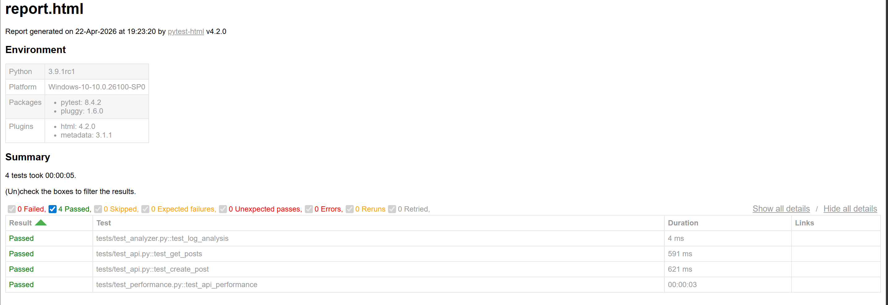

# 🚀 SmartTest Sentinel – API Testing & Log Analyzer

## 📌 Overview

SmartTest Sentinel is an API testing and log analysis tool built using Python and PyTest.  
It validates REST APIs, analyzes logs for root cause detection, and evaluates performance under multiple requests.

---

## 🧪 Key Features

- API testing using Python `requests` for validating REST endpoints  
- Response validation including status codes and JSON structure  
- Performance testing by measuring response time under repeated requests  
- Log analyzer to detect issues like timeouts, server errors, and connection failures  
- Logging system for execution tracking and debugging  
- HTML reporting using PyTest  
- Support for functional and performance testing  

---

## 🛠 Tech Stack

Python, PyTest, Requests, PyTest-HTML

---

## 📁 Project Structure

```
SmartTest-Sentinel/
│── tests/
│── analyzer/
│── utils/
│── reports/
│── requirements.txt
│── pytest.ini
│── README.md
```

---

## ▶️ How to Run

```
git clone https://github.com/Srishti-04/SmartTest-Sentinel.git
cd SmartTest-Sentinel
python -m venv venv
venv\Scripts\activate
pip install -r requirements.txt
pytest
```

---

## 📊 Test Report



---

## 🎯 Key Highlights

- Implemented API validation and response structure checks  
- Performed performance testing using repeated API calls  
- Developed log analysis for root cause detection  
- Generated structured test reports for analysis  

---

## 👩‍💻 Author

Srishti Jaiswal  
https://github.com/Srishti-04
